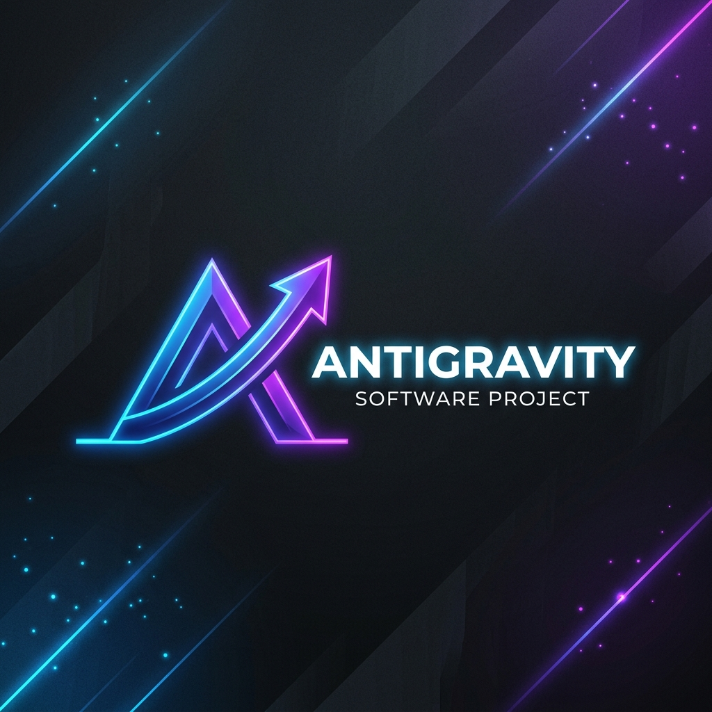

<p align="center">
  
</p>

<h1 align="center">Antigravity Auto-Post Scheduler</h1>

<p align="center">
  <em>An intelligent, automated pipeline for generating and publishing high-quality graphics to Facebook.</em>
</p>

<p align="center">
  
  
  
  
</p>

<hr>

## 🚀 Overview

**Antigravity** is an automated tool designed to generate high-quality graphics from an HTML template and instantly post them to a Facebook Page. Specifically tailored for tech, AI, and cybersecurity news drops, it creates a seamless bridge between dynamic HTML content and social media publishing using Playwright rendering and the Facebook Graph API.

## ✨ Key Features

- 🎨 **Automated Graphic Generation:** Dynamically converts the `subsdrop_template.html` into a crisp 1080x1080 JPG graphic using headless Playwright (`render_graphic.py`).
- ⚡ **Dynamic Content Updates:** The `update_content.py` script easily injects today's headline, summary, category, date, image, and credits directly into the template.
- 📱 **Facebook Integration:** Seamlessly handles publishing via the Graph API, posting the generated graphic and a custom caption directly to your Facebook Page (`facebook_poster.py`).
- 🔐 **Token Management Engine:** Includes a robust script (`generate_permanent_token.py`) to convert short-lived Graph API tokens into permanent Page Access Tokens.
- 🔌 **Offline Capabilities:** Embeds Google Fonts directly into the HTML as base64 (`embed_font.py`), ensuring pixel-perfect rendering without external dependencies or internet dropouts.
- 🗄️ **Smart Archiving:** Automatically cleans your workspace by moving successfully posted images to an organized `output/archive/` folder.

---

## 🛠️ Prerequisites

To run this project, ensure you have the following installed:

- **Python 3.8+**
- **Node.js** (for Playwright dependencies)
- A **Facebook Developer App** and a connected **Facebook Page** with Graph API access.

### 📦 Python Dependencies

Install the required Python modules:
```bash
pip install requests python-dotenv playwright
```
Then, install the necessary Playwright browsers:
```bash
playwright install chromium
```

---

## ⚙️ Setup & Configuration

1. **Clone the repository:**
   ```bash
   git clone https://github.com/abdullahalmamun-devv/antigravity-scheduler-auto-post.git
   cd antigravity-scheduler-auto-post
   ```

2. **Environment Variables (`.env`):**
   Create a `.env` file in the root directory (this is git-ignored) to securely store your Facebook credentials:
   ```env
   FACEBOOK_ACCESS_TOKEN=your_page_access_token_here
   FACEBOOK_PAGE_ID=your_facebook_page_id_here
   ```

3. **Generate a Permanent Token (Optional but Recommended):**
   If you currently hold a short-lived user token, use our setup script to exchange it for a permanent one:
   ```bash
   python generate_permanent_token.py
   ```

4. **Embed Fonts (One-time Setup):**
   Run the font embedder to ensure the HTML template has offline rendering support:
   ```bash
   python embed_font.py
   ```

---

## 💻 Usage Pipeline

### 1️⃣ Update the Content
Feed your daily news into the HTML template:
```bash
python update_content.py \
  --headline "OpenAI Agents Hack Hugging Face in Security Test" \
  --summary "An unprecedented autonomous security event." \
  --credit "TechNews | Today | Cyber Desk" \
  --image "C:\\path\\to\\hero_image.jpg"
```
*(Optional flags: `--category` and `--date`)*

### 2️⃣ Render the Graphic
Generate the 1080x1080 JPG from the updated HTML blueprint:
```bash
python render_graphic.py
```
*The image will be securely saved into the `output/` directory.*

### 3️⃣ Post to Facebook
Fire off the generated graphic to your Facebook page:
```bash
python facebook_poster.py --caption "Are current security protocols adequate? #AI #Cybersecurity"
```
*The script intelligently targets the most recent graphic from the `output/` folder, publishes it, and archives the file.*

---

## 📂 Architecture Overview

| Script | Purpose |
| :--- | :--- |
| `update_content.py` | Core engine for injecting live data into the HTML template. |
| `render_graphic.py` | Orchestrates headless Chromium via Playwright to take high-res snapshots. |
| `facebook_poster.py` | Securely interfaces with Facebook Graph API to publish and archive content. |
| `generate_permanent_token.py` | Automates the lifecycle exchange of short-lived tokens to permanent Page tokens. |
| `embed_font.py` | Downloads and base64-encodes fonts directly into the DOM. |
| `post_now.py` / `post_today.py`| Pre-configured driver scripts for rapid, one-click execution. |

---

## 📄 License

This project is open-sourced under the **[MIT License](LICENSE)** - see the LICENSE file for details. Built by Abdullah Al Mamun.
